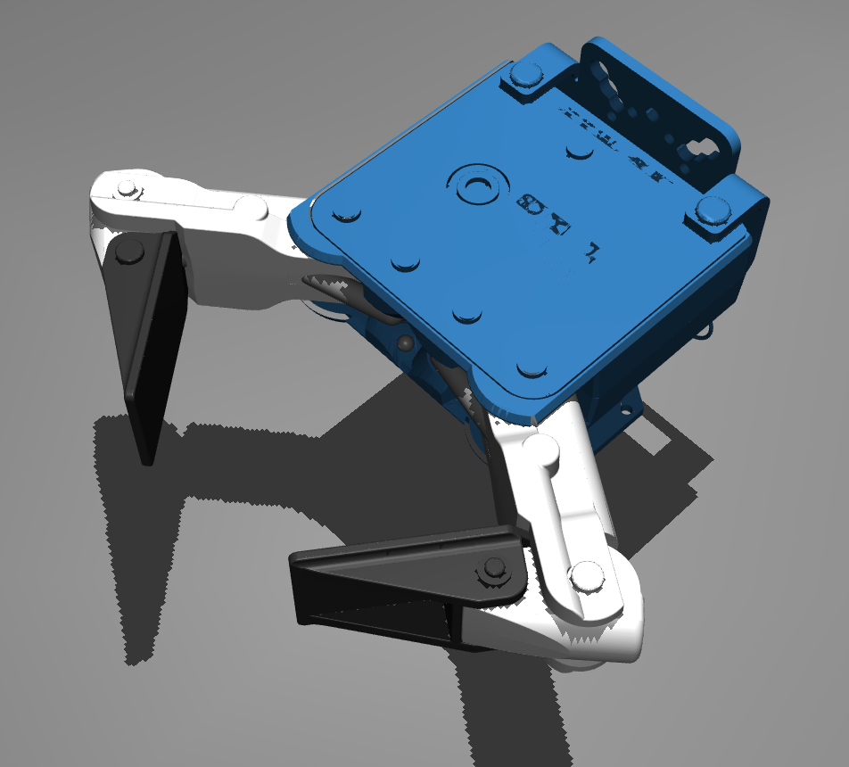

# EZGripper MuJoCo Simulation

High-fidelity [MuJoCo](https://mujoco.org) model for the **SAKE Robotics EZGripper** robotic gripper with realistic tendon-driven physics.



## Overview

This repository contains a physics-accurate MuJoCo model of the SAKE Robotics EZGripper Dual (Gen1/Gen2), featuring:

- ✅ **Tendon-driven mechanism** - Realistic cable actuation matching real hardware
- ✅ **Under-actuated fingers** - Single servo controls 2 opposing fingers
- ✅ **Adaptive grasping** - Fingers wrap around objects independently
- ✅ **Accurate meshes** - Real STL geometry from SAKE Robotics
- ✅ **MuJoCo 3.0+ compatible** - Works with latest MuJoCo versions

## Quick Start

### Installation

```bash
# Install MuJoCo (if not already installed)
pip3 install mujoco

# Clone this repository
git clone https://github.com/SAKErobotics/ezgripper_sim.git
cd ezgripper_sim

# Test the model
python3 test_gripper.py
```

### Interactive Viewer

```bash
python3 test_gripper.py
```

Use the MuJoCo viewer sliders to control the gripper actuator.

## EZGripper Specifications

### Mechanical Design

**Architecture**: Under-actuated, tendon-driven
- **Fingers**: 2 opposing fingers
- **Links per finger**: 2 (proximal + distal)
- **Joints per finger**: 2 (~110° range each)
- **Actuation**: Single Dynamixel MX-64AR servo

**Range of Motion**:
- **Full range**: 2500 servo units (0 = closed, 2500 = open)
- **Scaled range**: 0-100% (used in control interface)
- **Joint angles**: ~110° per joint

### Control Interface

The EZGripper uses two primary commands:

#### 1. Calibrate
```python
calibrate(servo)
```
- Moves gripper to closed position
- Resets zero position
- Should be run at startup

#### 2. Goto_Position(effort, position)
```python
goto_position(effort, position)
```

**Position Parameter** (0-100):
- `0`: Fully closed (continuous close mode)
- `1-100`: Specific position (% open)
- `100`: Fully open

**Effort Parameter** (0-100):
- `0`: Torque off (fingers can be back-driven)
- `1-100`: Torque level (% of max)

**Control Modes**:
- **Position = 0**: Torque control mode (best for grasping)
- **Position > 0**: Position control mode (best for positioning)

**Automatic Back-off Algorithm**:
- Closes until fingers stop moving
- Drops to 10% torque to maintain grasp
- Minimizes power and heat

### Physics Model

**Tendon System**:
- Spatial tendon routing through pulleys
- Realistic cable mechanics
- Spring-loaded opening (tendon closes, springs open)

**Contact Dynamics**:
- Finger-to-finger contact
- Finger-to-object contact
- Adaptive wrapping behavior

**Joint Properties**:
- Damping: 0.005
- Spring references for natural positions
- Limited ranges matching real hardware

## Model Structure

```
ezgripper.xml           # Main MuJoCo model
├── mount               # Gripper base/mount
├── F1_L1              # Finger 1, Link 1 (proximal)
│   └── F1_L2          # Finger 1, Link 2 (distal)
├── F2_L1              # Finger 2, Link 1 (proximal)
│   └── F2_L2          # Finger 2, Link 2 (distal)
└── flex_tendon        # Tendon connecting all links

meshes/
├── SAKE_Single_Mount.stl
├── SAKE_Palm_IM.stl
├── SAKE_Finger_L1_IM.stl
├── SAKE_Finger_L2_IM.stl
└── SAKE_Finger_Pad_IM.stl
```

## Integration with Robots

### Attaching to Robot Arm

To integrate the EZGripper into your robot model:

1. **Include the gripper body** (without worldbody):
```xml
<include file="ezgripper_body.xml"/>
```

2. **Attach to your end-effector**:
```xml
<body name="your_end_effector">
  <body name="ezgripper" pos="0 0 -0.05" quat="...">
    <!-- Include gripper here -->
  </body>
</body>
```

3. **Orient the gripper**:
   - Default: Gripper X-axis points forward
   - Rotate as needed for your application

### Example: Minilift SCARA Integration

See `examples/minilift_integration.xml` for a complete example of integrating the EZGripper with a SCARA arm.

## MuJoCo Version Compatibility

- ✅ **MuJoCo 3.0+**: Fully tested and supported
- ✅ **MuJoCo 2.x**: Should work (not actively tested)

**Tested with**:
- MuJoCo 3.3.7 on Ubuntu 24.04
- Python 3.12

## Files

- `ezgripper.xml` - Complete standalone model with floor
- `test_gripper.py` - Interactive test script
- `meshes/` - STL mesh files
- `ezgripper.png` - Preview image

## Credits

**Original Model**: [Vikash Kumar](https://github.com/vikashplus/ezgripper_sim) (2021)
**Hardware**: [SAKE Robotics](https://sakerobotics.com/)
**Maintained by**: SAKE Robotics

## License

Apache License 2.0 - See LICENSE file

## Resources

- **SAKE Robotics**: https://sakerobotics.com/
- **EZGripper Hardware**: https://sakerobotics.com/products
- **Python Drivers**: https://github.com/SAKErobotics/libezgripper
- **ROS 2 Drivers**: https://github.com/SAKErobotics/EZGripper_ros2
- **MuJoCo Documentation**: https://mujoco.readthedocs.io/

## Support

For questions or issues:
- GitHub Issues: https://github.com/SAKErobotics/ezgripper_sim/issues
- Email: support@sakerobotics.com
